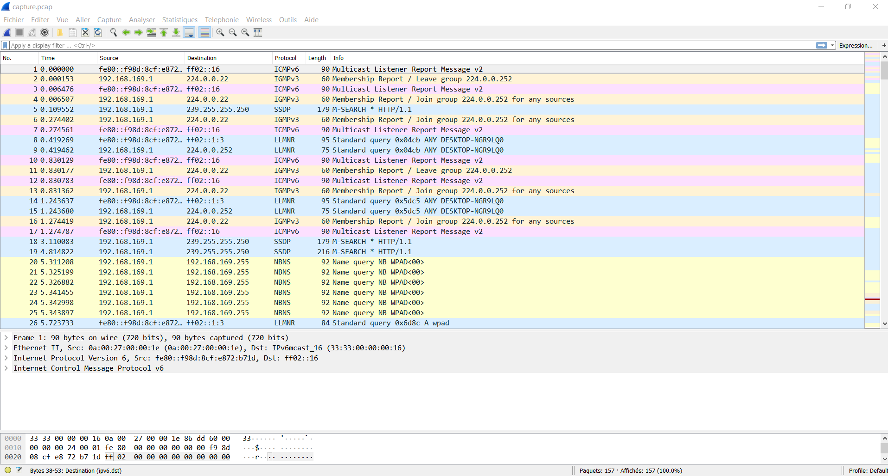

 # TP5 Réseau

* ping `client1` sur le `server1`

```bash
[remi@client1 ~]$ ping -c 4 server1
PING server1 (10.5.1.10) 56(84) bytes of data.
64 bytes from server1 (10.5.1.10): icmp_seq=1 ttl=62 time=22.9                                                                 ms
64 bytes from server1 (10.5.1.10): icmp_seq=2 ttl=62 time=25.2                                                                 ms
64 bytes from server1 (10.5.1.10): icmp_seq=3 ttl=62 time=35.1                                                                 ms
64 bytes from server1 (10.5.1.10): icmp_seq=4 ttl=62 time=28.6                                                                 ms

--- server1 ping statistics ---
4 packets transmitted, 4 received, 0% packet loss, time 3010ms
rtt min/avg/max/mdev = 22.961/28.007/35.141/4.590 ms
 3005ms
rtt min/avg/max/mdev = 38.164/41.702/43.773/2.157 ms
```

* ping `client2` sur le `server1`

```bash
[remi@client2 ~]$ ping -c 4 server1
PING server1 (10.5.1.10) 56(84) bytes of data.
64 bytes from server1 (10.5.1.10): icmp_seq=1 ttl=62 time=43.7 ms
64 bytes from server1 (10.5.1.10): icmp_seq=2 ttl=62 time=41.8 ms
64 bytes from server1 (10.5.1.10): icmp_seq=3 ttl=62 time=43.0 ms
64 bytes from server1 (10.5.1.10): icmp_seq=4 ttl=62 time=38.1 ms

--- server1 ping statistics ---
4 packets transmitted, 4 received, 0% packet loss, time 3005ms
rtt min/avg/max/mdev = 38.164/41.702/43.773/2.157 ms
```

* ping `server1` sur `client1`
```bash
[remi@server1 ~]$ ping -c 4 client1
PING client1 (10.5.2.10) 56(84) bytes of data.
64 bytes from client1 (10.5.2.10): icmp_seq=1 ttl=62 time=34.4 ms
64 bytes from client1 (10.5.2.10): icmp_seq=2 ttl=62 time=34.5 ms
64 bytes from client1 (10.5.2.10): icmp_seq=3 ttl=62 time=32.3 ms
64 bytes from client1 (10.5.2.10): icmp_seq=4 ttl=62 time=40.8 ms

--- client1 ping statistics ---
4 packets transmitted, 4 received, 0% packet loss, time 3016ms
rtt min/avg/max/mdev = 32.328/35.555/40.807/3.169 ms

```


* ping `server1` sur `client2`
```bash
[remi@server1 ~]$ ping -c 4 client2
PING client2 (10.5.2.11) 56(84) bytes of data.
64 bytes from client2 (10.5.2.11): icmp_seq=1 ttl=62 time=24.5 ms
64 bytes from client2 (10.5.2.11): icmp_seq=2 ttl=62 time=29.9 ms
64 bytes from client2 (10.5.2.11): icmp_seq=3 ttl=62 time=38.1 ms
64 bytes from client2 (10.5.2.11): icmp_seq=4 ttl=62 time=40.2 ms

--- client2 ping statistics ---
4 packets transmitted, 4 received, 0% packet loss, time 3002ms
rtt min/avg/max/mdev = 24.563/33.220/40.205/6.303 ms
```

# DHCP 

* Vérification du lancement du DHCPD avec `systemctl status dhcpd`
```bash
[root@dhcp-net2 dhcp]# systemctl status dhcpd
● dhcpd.service - DHCPv4 Server Daemon
   Loaded: loaded (/usr/lib/systemd/system/dhcpd.service; disa                                                                bled; vendor preset: disabled)
   Active: active (running) since Mon 2019-02-25 20:37:08 CET;                                                                 1min 7s ago
     Docs: man:dhcpd(8)
           man:dhcpd.conf(5)
 Main PID: 3443 (dhcpd)
   Status: "Dispatching packets..."
   CGroup: /system.slice/dhcpd.service
           └─3443 /usr/sbin/dhcpd -f -cf /etc/dhcp/dhcpd.co...

Feb 25 20:37:08 dhcp-net2.tp5.b1 systemd[1]: Started DHCPv4...
Feb 25 20:37:08 dhcp-net2.tp5.b1 dhcpd[3443]: No subnet dec...
Feb 25 20:37:08 dhcp-net2.tp5.b1 dhcpd[3443]: ** Ignoring r...
Feb 25 20:37:08 dhcp-net2.tp5.b1 dhcpd[3443]:    you want, ...
Feb 25 20:37:08 dhcp-net2.tp5.b1 dhcpd[3443]:    in your dh...
Feb 25 20:37:08 dhcp-net2.tp5.b1 dhcpd[3443]:    to which i...
Feb 25 20:37:08 dhcp-net2.tp5.b1 dhcpd[3443]: nt
Feb 25 20:37:08 dhcp-net2.tp5.b1 dhcpd[3443]: Listening on ...
Feb 25 20:37:08 dhcp-net2.tp5.b1 dhcpd[3443]: Sending on   ...
Feb 25 20:37:08 dhcp-net2.tp5.b1 dhcpd[3443]: Sending on   ...
Hint: Some lines were ellipsized, use -l to show in full.
```

* Capture de l'échange DORA avec WireShark
 